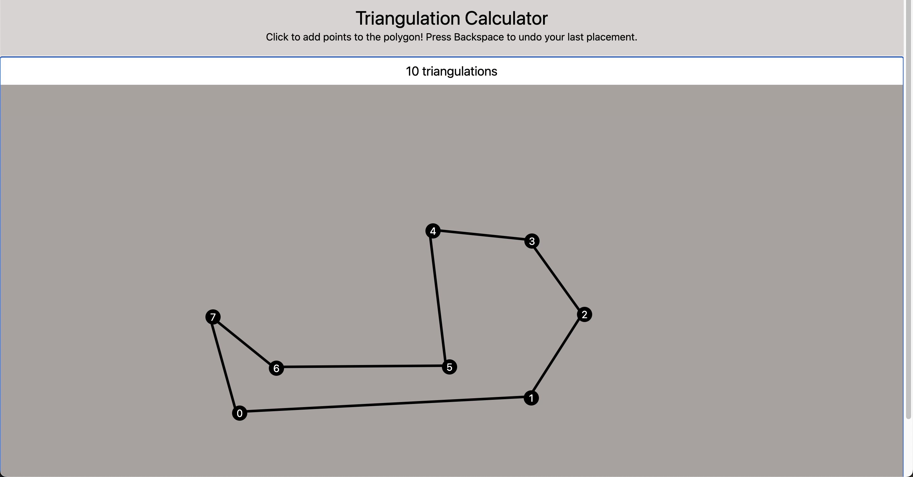
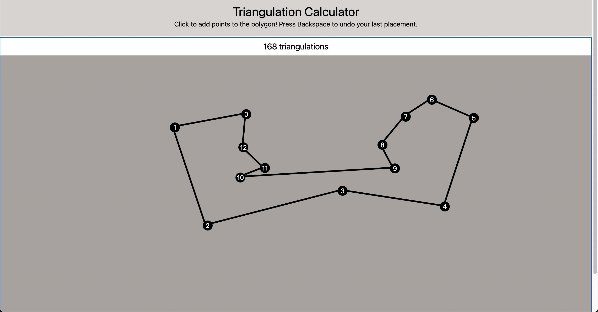
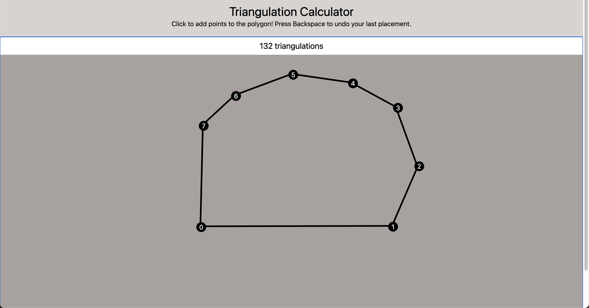

# Triangulation Calculator

## Description
A website that allows you to add points using your mouse to create a polygon, then calculate the number of distinct triangulations using a dynamic programming algorithm.

## Screenshots




## Installation
Clone this repository and install npm dependencies. Then, start the local server.

```
git clone https://github.com/tamandrew/triangulations-calculator.git
cd triangulations
npm install
npm start
```
